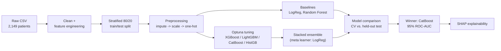

[README.md](https://github.com/user-attachments/files/30680965/README.md)
<div align="center">


# 🧠 Alzheimer's Disease Analysis & Prediction

**End-to-end analysis of 2,149 patient records — an interactive Power BI dashboard paired with a stacked machine-learning ensemble that predicts diagnosis with 95% ROC-AUC, fully explained with SHAP.**

[](https://www.python.org/)
[](#-interactive-power-bi-dashboard)
[](#-model-performance)
[](#-model-performance)
[](#-model-performance)
[](#-methodology)
[](#-explainability)
[](#-license)

</div>

---

## 📖 Overview

This project turns a raw clinical dataset into two things people can actually use: a **Power BI dashboard** for exploring the data visually, and a **tuned machine-learning pipeline** for predicting a diagnosis from patient features.

It covers the full pipeline end to end — cleaning, leakage-safe preprocessing, baseline models, Optuna-driven hyperparameter tuning across four gradient-boosting frameworks, a stacked ensemble, honest overfitting checks (CV vs. held-out test, not just train vs. test), and SHAP-based interpretability so the predictions aren't a black box.

> ⚠️ **Note:** The dataset is **synthetic**, generated for educational/data-science purposes (see [Dataset](#️-dataset)). Nothing in this repository is a clinical or diagnostic tool.

## 📑 Table of Contents

- [Highlights](#-highlights)
- [Interactive Power BI Dashboard](#-interactive-power-bi-dashboard)
- [Dataset](#️-dataset)
- [Methodology](#-methodology)
- [Model Performance](#-model-performance)
- [Explainability](#-explainability)
- [Tech Stack](#️-tech-stack)
- [Project Structure](#-project-structure)
- [Getting Started](#-getting-started)
- [Key Insights](#-key-insights)
- [Future Improvements](#-future-improvements)
- [License & Acknowledgments](#-license)

## ✨ Highlights

- 📊 **3-page Power BI dashboard** — patient overview, demographic breakdowns, and clinical/symptom insights, fully interactive with slicers for gender, age group, ethnicity, education, and BMI category.
- 🤖 **4 gradient-boosting models tuned with Optuna** (XGBoost, LightGBM, CatBoost, HistGradientBoosting) plus a stacked meta-ensemble, benchmarked against Logistic Regression and Random Forest baselines.
- 🏆 **95% ROC-AUC / 94% accuracy** on a held-out test set, with the winning model chosen honestly by cross-validated score — not by peeking at the test set.
- 🔍 **SHAP explainability** — not just *which* features matter, but *which direction* each one pushes an individual prediction.
- 🧪 **A rigor check most projects skip:** the notebook explicitly tests what happens if you remove the five cognitive/functional-assessment columns — the ones that behave more like diagnostic proxies than true risk factors — and reports how much the model's performance depends on them. See [Key Insights](#-key-insights).

## 📊 Interactive Power BI Dashboard

**Page 1 — Overview**


A snapshot of the full cohort: 2,149 patients, a 35.4% diagnosis rate, diagnosis broken down by gender, age group, and ethnicity, plus the lowest-risk education level and highest-risk age bracket surfaced as headline KPIs.

**Page 2 — Clinical & Symptom Insights**


Drills into the clinical side: average MMSE, ADL, and cholesterol readings, the most common symptoms and comorbidities among diagnosed patients, and how average MMSE score trends across age groups.

## 🗂️ Dataset

| | |
|---|---|
| **Source** | [Alzheimer's Disease Dataset](https://www.kaggle.com/datasets/rabieelkharoua/alzheimers-disease-dataset) — Rabie El Kharoua, Kaggle (CC BY 4.0) |
| **Records** | 2,149 patients |
| **Features** | 35 columns (33 predictors + `PatientID` + `Diagnosis` target) |
| **Target** | `Diagnosis` — binary, 1,389 negative / 760 positive (~35% prevalence) |
| **Type** | Synthetic, generated for data-science education |

Features span six categories:

| Category | Example columns |
|---|---|
| Demographics | `Age`, `Gender`, `Ethnicity`, `EducationLevel` |
| Lifestyle | `BMI`, `Smoking`, `AlcoholConsumption`, `PhysicalActivity`, `DietQuality`, `SleepQuality` |
| Medical history | `FamilyHistoryAlzheimers`, `CardiovascularDisease`, `Diabetes`, `Depression`, `HeadInjury`, `Hypertension` |
| Clinical measurements | `SystolicBP`, `DiastolicBP`, `CholesterolTotal`, `CholesterolLDL`, `CholesterolHDL`, `CholesterolTriglycerides` |
| Cognitive / functional assessment | `MMSE`, `FunctionalAssessment`, `MemoryComplaints`, `BehavioralProblems`, `ADL` |
| Symptoms | `Confusion`, `Disorientation`, `PersonalityChanges`, `DifficultyCompletingTasks`, `Forgetfulness` |

`PatientID` (a row counter) and `DoctorInCharge` (a single redacted constant) carry no signal and are dropped before modeling.

## 🔬 Methodology



1. **Leakage-safe split first.** The train/test split happens before any fitting — imputers, scalers, encoders, hyperparameter search, and every model only ever see `X_train` or a CV fold of it. `X_test` is touched exactly once, at the very end.
2. **Preprocessing.** Numeric columns are median-imputed and standard-scaled; the nominal `Ethnicity` column is one-hot encoded.
3. **Baselines.** Logistic Regression and an untuned Random Forest set the floor to beat.
4. **Hyperparameter tuning with Optuna.** Each of XGBoost, LightGBM, CatBoost, and HistGradientBoosting is tuned independently with Optuna's TPE sampler and early stopping inside every fold, rather than a fixed grid.
5. **Stacked ensemble.** The four tuned boosters feed a `StackingClassifier` with a logistic-regression meta-learner.
6. **Honest model selection.** Every model is judged on 5-fold CV score first, evaluated once on the held-out test set, and the train/CV/test gaps are inspected explicitly to catch overfitting — not just asserted away.

## 🏆 Model Performance

Cross-validated results (5-fold, stratified):

| Model | CV Accuracy | CV ROC-AUC | CV F1 |
|---|---|---|---|
| Logistic Regression | 82.6% | 0.903 | 0.770 |
| Random Forest (untuned) | 92.6% | 0.953 | 0.887 |
| XGBoost (Optuna-tuned) | – | 0.961 | – |
| LightGBM (Optuna-tuned) | – | 0.960 | – |
| HistGradientBoosting (Optuna-tuned) | – | 0.957 | – |
| **CatBoost (Optuna-tuned) 🏆** | **95.0%** | **0.958** | **0.929** |

**CatBoost was selected as the final model** — it edged out both the other tuned boosters *and* the stacked ensemble on cross-validated ROC-AUC, a useful reminder that a well-tuned single model can beat a more complex stack.

**Held-out test set (430 patients, never touched during tuning):**

| | Precision | Recall | F1-score | Support |
|---|---|---|---|---|
| No Alzheimer's | 0.96 | 0.95 | 0.95 | 278 |
| Alzheimer's | 0.92 | 0.92 | 0.92 | 152 |
| **Accuracy** | | | **0.94** | 430 |

Test ROC-AUC: **0.950** · Train→CV gap: 2.5 pts · CV→Test gap: 0.8 pts (small and expected — no meaningful overfitting).

## 🔍 Explainability

Feature importance (and, for `HistGradientBoosting`, permutation importance as a fallback) is computed for the strongest individual booster, then handed to **SHAP's `TreeExplainer`** to go a level deeper — not just *which* features matter most, but which direction each one pushes an individual patient's prediction, and by how much.

## 🛠️ Tech Stack

`Python` · `pandas` · `numpy` · `scikit-learn` · `XGBoost` · `LightGBM` · `CatBoost` · `Optuna` · `SHAP` · `matplotlib` / `seaborn` · `joblib` · `Power BI`

## 📁 Project Structure

```
.
├── Alzheimers_Disease_Prediction.ipynb   # full ML pipeline: EDA -> preprocessing -> tuning -> ensemble -> SHAP
├── Alzhiemer_dashboard.pbix              # Power BI dashboard (3 pages)
├── alzheimers_disease_data.csv           # source dataset (2,149 patients)
├── requirements.txt                      # Python dependencies
├── assets/                               # dashboard screenshots used in this README
│   ├── cover.png
│   ├── dashboard_overview.png
│   └── dashboard_clinical_insights.png
└── README.md
```

## 🚀 Getting Started

**Prerequisites:** Python 3.10+, and [Power BI Desktop](https://powerbi.microsoft.com/desktop/) (Windows) if you want to open the `.pbix` file.

```bash
# 1. Clone the repo
git clone https://github.com/<your-username>/<your-repo>.git
cd <your-repo>

# 2. Install dependencies
pip install -r requirements.txt

# 3. Launch the notebook
jupyter notebook Alzheimers_Disease_Prediction.ipynb
```

**Using the trained model on new data:**

```python
import joblib

pipe = joblib.load("alzheimers_best_model_pipeline.pkl")

pipe.predict(new_patients_df)          # 0 / 1
pipe.predict_proba(new_patients_df)    # probability of diagnosis
```

> `new_patients_df` needs the same raw columns as the training data — run it through the same cleaning/feature-engineering step in the notebook before calling `predict`.

To explore the dashboard, open `Alzhiemer_dashboard.pbix` in Power BI Desktop.

## 💡 Key Insights

- **Diagnosis rate:** ~35.4% of patients in the dataset are diagnosed, consistent with the age-based and gender-based breakdowns in the dashboard.
- **Risk skews with age and education:** the 60–69 group shows the highest diagnosis rate, and higher education levels correlate with the lowest one.
- **Five features carry almost all the predictive signal.** `FunctionalAssessment`, `ADL`, `MemoryComplaints`, `MMSE`, and `BehavioralProblems` dominate feature importance. That's expected — they're cognitive/functional *assessments*, closer to diagnostic proxies than independent risk factors. Dropping all five and keeping only demographics, lifestyle, vitals, labs, and comorbidities collapses model performance back to roughly the majority-class baseline (AUC ≈ 0.58 vs. 0.96) — meaning the ~30 remaining features carry very little standalone signal in this particular synthetic dataset.
- **Most common symptoms** among diagnosed patients: memory complaints, forgetfulness, and behavioral problems; **most common comorbidities**: depression, hypertension, and cardiovascular disease.

## 🔮 Future Improvements

- [ ] Package the model behind a lightweight API (FastAPI/Flask) for live inference
- [ ] Add a Streamlit app as a lighter-weight alternative to the Power BI dashboard
- [ ] Expand SHAP analysis with dependence plots for the top features
- [ ] Validate the "diagnostic-proxy" finding against a real-world (non-synthetic) clinical dataset

## 📜 License

Code in this repository is available under the [MIT License](LICENSE). The dataset is provided by Rabie El Kharoua on Kaggle under a [CC BY 4.0](https://creativecommons.org/licenses/by/4.0/) license — please cite the original source if you reuse it.

## 🙏 Acknowledgments

- Dataset: El Kharoua, R. (2024). *Alzheimer's Disease Dataset.* Kaggle. [DOI: 10.34740/KAGGLE/DSV/8668279](https://www.kaggle.com/dsv/8668279)

## 📬 Contact

Questions or feedback? Open an issue, or reach out at **your-email@example.com** · [LinkedIn](https://linkedin.com/in/your-profile) · [Portfolio](https://your-portfolio.com)

<div align="center">

*Because some moments — and some insights — are meant to last.* ✨

</div>
